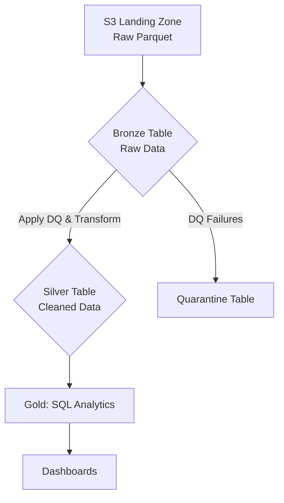

# iFood - Data Challenge

Este repositório contém a solução para um desafio de engenharia de dados, que consiste em construir um pipeline para processar dados de corridas de táxis de Nova York. O objetivo é demonstrar habilidades em arquitetura, engenharia e análise de dados, utilizando tecnologias como **PySpark**, **Databricks** e **Delta Lake**.

## Arquitetura da Solução

A solução foi desenvolvida utilizando **Databricks** e segue uma arquitetura **Medalhão (Bronze, Silver, Gold)**, que promove a governança e a qualidade dos dados em camadas.



1.  **Landing Zone (Amazon S3):** Os arquivos brutos `.parquet` dos meses de Janeiro a Maio de 2023 são baixados e armazenados no caminho `s3://datalake-ifood-case/landing/`.
2.  **Camada Bronze (Tabela Delta no S3):** Os dados brutos são ingeridos da Landing Zone para a tabela Delta `taxi_bronze`, localizada em `s3://datalake-ifood-case/bronze/`. Esta camada serve como um backup versionado e auditável dos dados originais.
3.  **Camada Silver (Tabela Delta no S3):** A partir da camada Bronze, os dados são limpos, transformados e enriquecidos, resultando na tabela `taxi_silver`, localizada em `s3://datalake-ifood-case/silver/`. Esta é a camada principal para consumo e análises. As transformações incluem:
    *   Seleção das colunas de interesse: `VendorID`, `tpep_pickup_datetime`, `tpep_dropoff_datetime`, `passenger_count`, `total_amount`.
    *   Conversão de tipos de dados para garantir consistência.
    *   Aplicação de regras de qualidade de dados (ex: `total_amount > 0`) e separação de registros inválidos para uma camada de **Quarentena**.
    *   Criação de colunas derivadas (`pickup_year`, `pickup_month`) para otimizar consultas.
    *   A tabela é particionada por ano e mês para melhorar a performance das queries.

4.  **Camada de Quarentena (Tabela Delta no S3):** Registros que falham nas validações de qualidade da camada Silver são movidos para a tabela `taxi_quarantine` em `s3://datalake-ifood-case/quarantine/` para análise posterior.

5.  **Camada Gold (Views/Análises):** As análises de negócio são realizadas diretamente sobre a tabela Silver através de queries SQL, que podem ser salvas como `Views` para facilitar o acesso por usuários finais.

### Justificativas Técnicas

*   **PySpark:** Utilizado como principal ferramenta de ETL por sua capacidade de processamento distribuído e escalável, ideal para grandes volumes de dados.
*   **Databricks:** Escolhido por ser uma plataforma unificada que integra perfeitamente Spark, notebooks, gerenciamento de jobs e um metastore, simplificando o desenvolvimento e a operação do pipeline.
*   **Delta Lake:** Adotado como formato de armazenamento por garantir transações ACID, versionamento de dados (time travel) e por otimizar o desempenho de queries em um Data Lake.
*   **SQL para Análise:** A disponibilização dos dados via tabelas Delta no metastore do Databricks permite que usuários finais (analistas, cientistas de dados) consultem os dados de forma simples e eficiente usando a linguagem SQL padrão, com a qual já estão familiarizados.

## Qualidade dos Dados

Uma etapa crucial do pipeline é a validação da qualidade dos dados na transição da camada Bronze para a Silver. Registros que não atendem aos critérios definidos são separados para uma tabela de quarentena. As seguintes regras são aplicadas:

*   `total_amount` deve ser maior que zero.
*   `passenger_count` deve ser maior que zero.
*   `pickup_datetime` e `dropoff_datetime` não podem ser nulos.
*   A data/hora de `dropoff_datetime` deve ser posterior à de `pickup_datetime`.
*   A duração da viagem não pode exceder 24 horas.

## Dicionário de Dados (Camada Silver)

A tabela `taxi_silver` é a fonte de verdade para análises e contém as seguintes colunas:

| Coluna             | Tipo de Dado  | Descrição                                                              |
|--------------------|---------------|------------------------------------------------------------------------|
| `vendor_id`        | `INTEGER`     | ID que identifica o provedor de tecnologia da corrida.                 |
| `pickup_datetime`  | `TIMESTAMP`   | Data e hora em que a corrida começou.                                  |
| `dropoff_datetime` | `TIMESTAMP`   | Data e hora em que a corrida terminou.                                 |
| `passenger_count`  | `INTEGER`     | O número de passageiros no veículo.                                    |
| `total_amount`     | `DOUBLE`      | O valor total cobrado do passageiro.                                   |
| `pickup_month`     | `INTEGER`     | Mês de início da corrida (coluna de partição).                         |
| `pickup_year`      | `INTEGER`     | Ano de início da corrida (coluna de partição).                         |

## Perguntas de Negócio

O pipeline foi projetado para responder às seguintes perguntas de negócio:

1.  Qual a média de valor total (`total_amount`) recebido por mês, considerando toda a frota?
2.  Qual a média de passageiros (`passenger_count`) por hora do dia durante o mês de maio?

## Estrutura do Repositório

O código foi modularizado para promover a reutilização e a clareza, seguindo as melhores práticas de engenharia de software.

```
ifood-case/ 
├─ src/
│ ├─ common/
│ │ └─ spark.py             # Função para criar e configurar a SparkSession
│ ├─ jobs/
│ │ └─ bronze_ingestion.py  # Lógica do pipeline de ingestão Bronze
│ │ └─ silver_ingestion.py  # Lógica do pipeline de ingestão Silver e Data Quality
│ ├─ utils/
│ │ ├─ data_loader.py       # Função para download automático dos dados
│ │ └─ data_quality.py      # Funções para aplicar as regras de qualidade
│ └─ main.py                # Ponto de entrada que orquestra a execução do pipeline 
├─ analysis/
│ └─ queries.sql            # Queries SQL para responder às perguntas de negócio
├─ tests/
│ └─ test_data_quality.py   # Testes unitários para as regras de qualidade
├─ README.md                # Este arquivo 
└─ requirements.txt         # Dependências do projeto
```

## Instruções de Execução

Siga os passos abaixo para executar a solução no ambiente **Databricks** conectado à sua conta **AWS**.

### 1. Pré-requisitos (Configuração na AWS)

1.  **Conta AWS:** Você precisa de uma conta na AWS com permissões para criar buckets S3 e roles no IAM.
2.  **Bucket S3:** Crie um bucket S3 que servirá como seu Data Lake. Para este projeto, o nome utilizado é `datalake-ifood-case`.
3.  **IAM Role e Instance Profile:** Para que o Databricks possa acessar o S3 de forma segura, crie um **Instance Profile**:
    *   No console da AWS, vá para o **IAM** e crie uma nova **Role**.
    *   Selecione `AWS service` como tipo de entidade confiável e `EC2` como caso de uso.
    *   Anexe a política `AmazonS3FullAccess` (para simplificar) ou uma política customizada que dê permissão de leitura e escrita apenas no bucket `datalake-ifood-case`.
    *   Dê um nome à role (ex: `databricks-s3-access-role`) e crie-a.
    *   O **Instance Profile** é criado automaticamente com o mesmo nome da role.

### 2. Configuração do Ambiente Databricks

1.  **Crie uma conta** no Databricks (pode ser a versão Trial para ter acesso à integração com AWS).
2.  **Crie um Cluster:**
    *   No menu lateral, vá em `Compute`, clique em `Create Cluster`.
    *   Em `Advanced Options` -> `Instance Profile`, selecione o Instance Profile que você criou no passo anterior (`databricks-s3-access-role`).
    *   Finalize a criação do cluster e aguarde ele iniciar.

### 3. Upload do Código

1.  **Importe o repositório:**
    *   No menu lateral do Databricks, vá em `Workspace`.
    *   `Create` -> `Git Folder`
    *   E insira os dados do repositório:
        - https://github.com/brunobta/ifood-case
    *   `Create Git Folder`

### 4. Instalação das Dependências

O Databricks Runtime já inclui as bibliotecas `pyspark` e `delta-spark`. Você só precisa instalar as dependências adicionais listadas no `requirements.txt` (neste caso, `requests`).

1.  No menu lateral, vá em `Compute` e clique no seu cluster.
2.  Vá para a aba **`Libraries`**.
3.  Clique em **`Install new`**.
4.  Para `Library Source`, selecione **`Workspace`**.
5.  No campo `Workspace File Path`, navegue e selecione o arquivo `requirements.txt` que você subiu no passo anterior.
6.  Clique em **`Install`**. O cluster irá instalar as bibliotecas e reiniciar.

### 5. Execução do Pipeline de Ingestão

O pipeline completo, incluindo o download dos dados e a ingestão, é executado a partir de um único ponto de entrada.

1.  No `Workspace`, acesse o arquivo `src/main.py`.
2.  Anexe o cluster ativo.
4.  Execute o arquivo python. O script irá:
    *   Baixar automaticamente os arquivos `.parquet` necessários para a `landing_zone`.
    *   Executar o pipeline de ingestão, criando as tabelas `taxi_bronze` e `taxi_silver`.
    *   Registrar as tabelas no Metastore do Databricks para que possam ser consultadas via SQL.

### 6. Execução das Análises

1.  Crie um novo notebook SQL chamado `analysis_notebook`.
2.  Copie o conteúdo do arquivo `analysis/queries.sql` para células separadas no notebook.
3.  Execute cada célula para obter as respostas para as perguntas do desafio. Os resultados serão exibidos em formato de tabela.

### 7. Criando um Dashboard de Análise Visual

Para apresentar os resultados de forma interativa, você pode criar um dashboard no ambiente **Databricks SQL**. Siga os passos abaixo:

1.  **Mude para o ambiente SQL:**
    *   No menu lateral esquerdo do Databricks, mude a persona de `Data Science & Engineering` para **`SQL`**.

2.  **Crie as Visualizações:**
    *   No menu lateral, vá em **`SQL Editor`**.
    *   **Gráfico 1: Média de Faturamento Mensal:**
        *   Cole a primeira query do arquivo `analysis/queries.sql`. Para uma melhor visualização, podemos formatar a data:
          ```sql
          SELECT
               MAKE_DATE(pickup_year, pickup_month, 1) AS ride_month
              ,ROUND(AVG(total_amount), 2) AS average_total_amount
          FROM taxi_silver
          GROUP BY ride_month
          ORDER BY ride_month;
          ```
        *   Execute a query. Abaixo da tabela de resultados, clique em **`+ Add Visualization`**.
        *   Escolha `Bar` (Barras) ou `Line` (Linha) como tipo de visualização, configure o eixo X para `ride_month` e o eixo Y para `average_total_amount`. Salve a visualização.
    *   **Gráfico 2: Média de Passageiros por Hora:**
        *   Em uma nova aba, cole a segunda query do arquivo `analysis/queries.sql`.
        *   Execute-a e crie uma nova visualização do tipo `Bar`, com o eixo X sendo `pickup_hour` e o eixo Y `average_passenger_count`. Salve a visualização.

3.  **Monte o Dashboard:**
    *   No menu lateral, vá em **`Dashboards`**.
    *   Clique em **`Create Dashboard`**, dê um nome (ex: "Análise de Corridas de Táxi - NY") e crie.
    *   Dentro do dashboard, clique em **`Add`** -> **`Visualization`** e adicione os dois gráficos que você salvou.

4.  **Organize e Publique:**
    *   Arraste e redimensione os gráficos como preferir.
    *   Quando terminar, clique em **`Done Editing`**.
    *   Você pode usar o botão **`Share`** para compartilhar o link do seu dashboard.

### 8. Execução dos testes unitários

Para garantir a corretude das regras de qualidade de dados, foram criados testes unitários utilizando `pytest`. Para executá-los, siga os passos:

1.  **Abra um terminal** no ambiente Databricks ou em sua máquina local com o projeto configurado.
2.  Navegue até o diretório raiz do projeto.
3.  Execute o seguinte comando:

    ```bash
    pytest
    ```

O Pytest descobrirá e executará automaticamente os testes definidos em `tests/utils/test_data_quality.py`.

## Melhorias Futuras

Para evoluir a solução, as seguintes melhorias podem ser implementadas:

*   **CI/CD:** Automatizar testes e deploys utilizando GitHub Actions.
*   **Infraestrutura como Código (IaC):** Gerenciar a infraestrutura AWS e Databricks (clusters, jobs) com Terraform.
*   **Orquestração com Databricks Jobs:** Substituir a execução manual via notebook por um Job agendado no Databricks para maior robustez e automação.